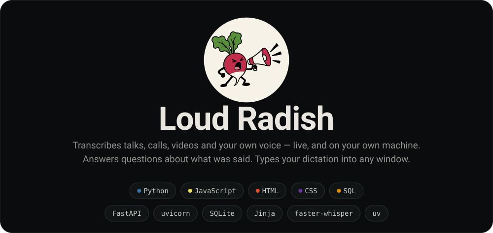
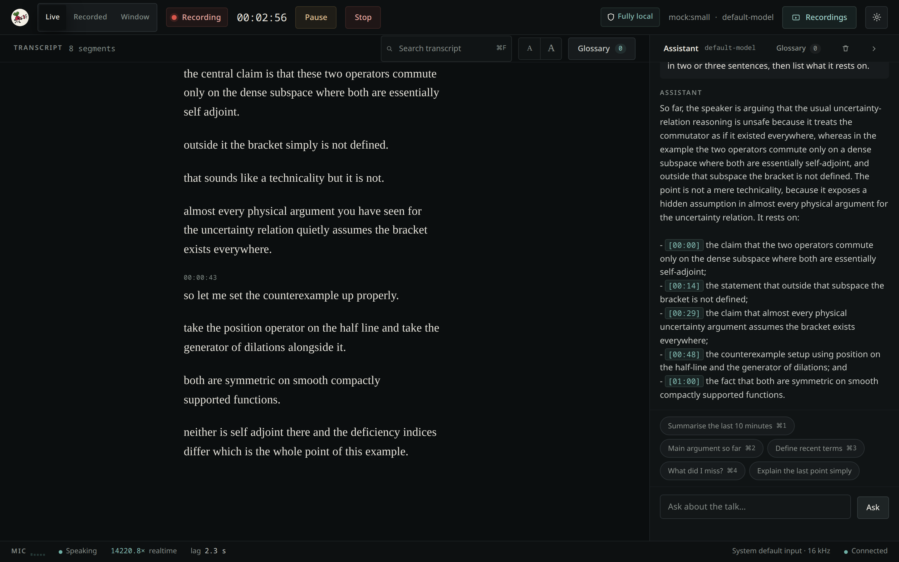
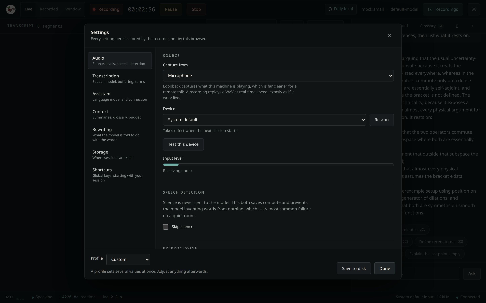
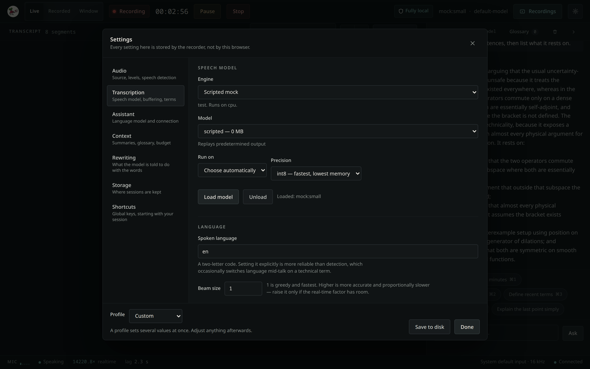
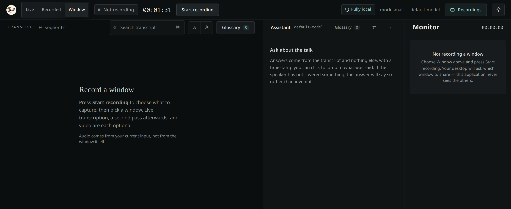
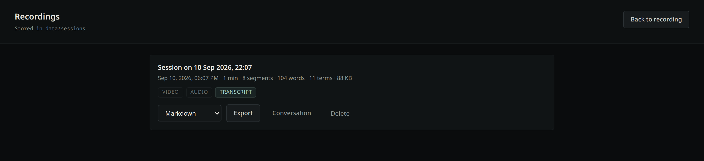

<p align="center">
  
</p>

<!-- The banner is generated: `uv run docs/assets/make_header.py` redraws it from the mark in
     `web/frontend/static/brand/radish.svg`. Its two tagline lines condense the paragraph below,
     so if that paragraph changes, edit TAGLINE in the generator and re-run it. -->

**Turns anything this machine can hear into text you can work with, as it is being said.** Sit in a
talk and read it as it is transcribed. Record a meeting, a call or a window on your desktop, with
video if you want it, and get a second, more accurate pass when it ends. Ask questions about what
was said and get an answer with timestamps you can click back to. Or press a shortcut, speak, press
it again, and have the tidied text typed straight into whatever window you were already in.

There is not one thing this does. The common part is that the audio and the text stay on your own
machine: point it at a microphone, at whatever your speakers are playing, or at a window, and
nothing is uploaded.

<p align="center">
  
</p>

<!-- DRAFT status line — my reading of the evidence, for you to confirm or soften.
     208 commits, 2026-08-14 to 2026-09-09, solo. Fourteen planned phases complete.
     2,163 tests pass. Linux only, one user, loopback only, no authentication.
     `active` on a repository that later goes quiet is a false claim on the front
     page, so if you stop working on this, change this line first. -->

> **Status:** working and in daily use, built solo over four weeks. All fourteen planned phases are
> complete and the test suite passes. **Linux only** — capture goes through PipeWire and the D-Bus
> screen-cast portal. Single user, bound to loopback, no authentication. Which behaviours have been
> confirmed on real hardware, and which have not, is recorded honestly in
> [docs/checklist.md](docs/checklist.md).

<!-- DRAFT "why" — two paragraphs I inferred from the code and the decision log.
     This is the section studies find missing from three-quarters of READMEs and the
     one a reader most needs, and it is the one I cannot write for you: it requires
     knowing why you made these choices, and an invented motivation is a claim you
     would have to defend to someone who read it. Replace with the real reason. -->

## Why this exists

A recorded talk is easy to obtain and nearly useless. You end up with an hour of audio you will
never scrub through, or a hosted transcript that is a wall of undifferentiated text with somebody
else's copy of your seminar attached to it. The thing you actually want during a talk is to ask a
question about it — *what was the claim ten minutes ago, what does that term mean, what did I
miss while I was writing* — and get an answer you can verify by jumping to the moment it was said.

So the two hard parts here are not transcription. They are **committing text you can trust** and
**answering only from what was actually said**. Committed text is never revised, the uncertain tail
is drawn as a visibly separate thing, and the assistant cites a timestamp for every claim and says
when the speaker did not cover something rather than filling the gap. The speech model runs on your
machine and the language model can too, which is the difference between a tool you can point at a
private conversation and one you cannot.

## Run it

Requires Python 3.11+ on Linux. There is no Node toolchain and no build step.

Everything is managed by [`uv`](https://docs.astral.sh/uv/), so if you do not already have it:

```bash
curl -LsSf https://astral.sh/uv/install.sh | sh
```

Then, in the clone:

```bash
uv sync && uv run app.py
```

Then open <http://127.0.0.1:8395>.

From a clean clone that is about seventeen seconds — fifteen to install sixty-seven packages, one
to start serving. Out of the box it runs a **scripted mock speech model**, which transcribes a
fixed passage of placeholder text: enough to see the whole interface work before any model weights
are downloaded. Choose a real model, and your microphone, in **Settings → Transcription** and
**Settings → Audio**; `faster-whisper` fetches its weights on first use.

Settings → Audio has a **Test this device** button that opens the input and tells you whether it is
actually producing usable audio. Worth pressing before every talk. It is the one check that catches
a muted microphone before the transcript comes back empty.

## What it does

Ten things, and the README used to describe four of them.

- **Three capture modes.** *Live* transcribes continuously while it records. *Recorded* captures
  first and transcribes the whole file when you stop, which is faster and more accurate when you do
  not need to read along. *Window* records a window on your desktop, with live transcription, a
  second pass afterwards, and video each independently optional.
- **Three sources.** A microphone; whatever this machine is playing, which is far cleaner for a
  remote talk than a microphone pointed at a speaker; or a WAV file replayed at real-time speed,
  exactly as if it were live.
- **An assistant that answers from the transcript and nothing else.** Every claim carries a
  timestamp you can click to jump to what was said. When the speaker has not covered something the
  answer says so rather than inventing it. Four one-key questions are bound to ⌘1–⌘4 — summarise
  the last ten minutes, the main argument so far, define recent terms, what did I miss.
- **A glossary that builds itself** as terms appear, alongside rolling summaries kept inside a
  configurable context budget.
- **Transcript polish.** A language model tidies the committed prose into readable paragraphs, and
  **what it is told to do is a setting you can edit**, not a decision baked into the code.
- **Two transcription passes, both kept.** A window or recorded session holds the live transcript
  and the more accurate final one, and every reader — the pane, the exports, the assistant — can be
  pointed at either.
- **Exports that are actually useful.** Transcript as Markdown, SRT or JSON. The conversation
  separately, because it is usually not what you want in the transcript file. Video as MP4 in five
  presets from *Original* through *Balanced* to *Audio only*. And a self-contained web app bundle
  you can open in a browser with no server.
- **Push-to-talk dictation.** A global shortcut records you, transcribes it, has the language model
  tidy it, and types it into whatever window has focus. Ordered, probed backends for clipboard and
  keystroke, so it works across desktop environments.
- **A desktop presence.** A tray companion that shows capture mode and run state at a glance, and
  global shortcuts that start and stop a session without switching to the browser.
- **Everything configurable from inside the application.** There is no config file to edit. Seven
  settings sections cover audio, the speech model, the assistant, context, rewriting, storage and
  shortcuts, and the settings live with the recorder rather than in your browser.

<table>
<tr>
<td width="50%">

<p><em>Seven settings sections, and no config file. <strong>Test this device</strong> opens the
input and tells you whether it is really producing audio.</em></p>
</td>
<td width="50%">

<p><em>Choosing a speech model — engine, size, device and precision, offering only what this
machine can actually run.</em></p>
</td>
</tr>
<tr>
<td width="50%">

<p><em>Window capture. Your desktop asks which window to share; this application never sees the
others.</em></p>
</td>
<td width="50%">

<p><em>Every past session, what it holds, and how to get it out.</em></p>
</td>
</tr>
</table>

## How it fits together

```text
microphone / system loopback / WAV file
    ▼  audio capture — 16 kHz mono, ring-buffered, never blocking
    ▼  voice activity detection — speech flag, hysteresis, pause events
    ▼  streaming engine ◄──► ASR abstraction   (swap the speech model here)
    ▼  transcript store — SQLite, append-only, written through on commit
    ▼  transport — HTTP for operations, WebSocket for the live stream
    ▼  browser — committed text, and a tentative tail shown distinctly
```

The design rests on two swap points: the **ASR interface**, so the speech model is a configuration
value rather than an architectural commitment, and the **LLM interface**, so the assistant can be a
local server or a hosted API. [docs/architecture.md](docs/architecture.md) explains both.

Two properties are worth knowing before reading the code. Committed text is **immutable** — once a
sentence is written to the transcript it never changes — and the tentative tail is a **separate
thing entirely**, replaced wholly on each update rather than appended. Confusing the two is the
bug this design exists to prevent.

## Privacy

With a local speech model and a local language model, no audio and no text leaves the machine, and
the header says so at a glance. Audio is **not** retained by default. The server binds to
`127.0.0.1` because the application has no authentication — exposing it on a network interface
would publish an unauthenticated transcript of a private room.

The screenshots above are captured against the mock speech model for the same reason: a real
transcript is somebody's talk, and it does not belong in a public repository. See
[docs/assets/README.md](docs/assets/README.md).

<details>
<summary><strong>Checks, and upgrading from a pre-rename install</strong></summary>

<br />

Run the checks:

```bash
uv run pytest && uv run ruff check .
```

2,163 tests in about a hundred seconds. Nothing in that run talks to a real language model:
`tests/assistant/test_llm_live.py` is marked `live_llm` and skips unless you pass
`--run-live-llm`, because a server answering on localhost is not the same thing as consent to
generate against it on every `pytest`. Point those tests elsewhere with `LLM_TEST_ENDPOINT` and
`LLM_TEST_MODEL`.

**Upgrading from a pre-rename install.** This was two names before it was one:
`TranscriberPrototype` in the documentation and *Live Seminar Transcriber* in the interface.
Everything migrates on first start — the settings file is renamed, stored credentials move to the
new keyring service, and the old `TRANSCRIBER_*` environment variables are still read, with a
warning. Re-run `uv run scripts/install_autostart.py` if you use autostart or global shortcuts, and
re-copy any shortcut you bound by hand: the control script is now `utils/loud_radish_ctl.py`. See
**D-038** in [docs/documentation.md](docs/documentation.md).

</details>

## Documentation

`docs/` is the single source of truth for this repository. Start there.

| Read this | For |
|---|---|
| [docs/documentation.md](docs/documentation.md) | Purpose, stack, decision log, current status |
| [docs/workflow.md](docs/workflow.md) | Install, run, test, lint, and env commands |
| [docs/checklist.md](docs/checklist.md) | What is done, what remains, and what is unverified |
| [docs/plans/live-seminar-transcriber.md](docs/plans/live-seminar-transcriber.md) | The build plan, phase by phase |
| [docs/architecture.md](docs/architecture.md) | System design, constraints, component boundaries |
| [docs/structure.md](docs/structure.md) | Repository layout and why each directory exists |
| [docs/routes.md](docs/routes.md) · [docs/api-contract.md](docs/api-contract.md) | HTTP surface and event contract |
| [docs/data-flow.md](docs/data-flow.md) | How data moves through the pipeline |
| [docs/component-map.md](docs/component-map.md) · [docs/design-system.md](docs/design-system.md) | Frontend ownership, design tokens, the accessibility baseline |
| [docs/deployment.md](docs/deployment.md) | Installing, what lands on disk, hardware expectations |

## Working in this repository

Python is managed **only** with `uv`. All web application code lives under `web/`, and all
documentation under `docs/`. `app.py` at the root is a launcher and contains no application logic.
The frontend has no package manager and no build step: Jinja templates rendered by the backend,
plus hand-written ES modules and CSS served as static files.

AI agents must read [docs/skills/global-project-rules/SKILL.md](docs/skills/global-project-rules/SKILL.md)
before making changes. Pointer files for **Claude Code** (`.claude/skills/`), **OpenAI Codex**
(`.agents/skills/`), and **Cursor** (`.cursor/rules/`) all route back to it.

## Licence

[MIT](LICENSE). The copyright line reads `brendondgr`; replace it with your legal name if you would
rather it said that.
